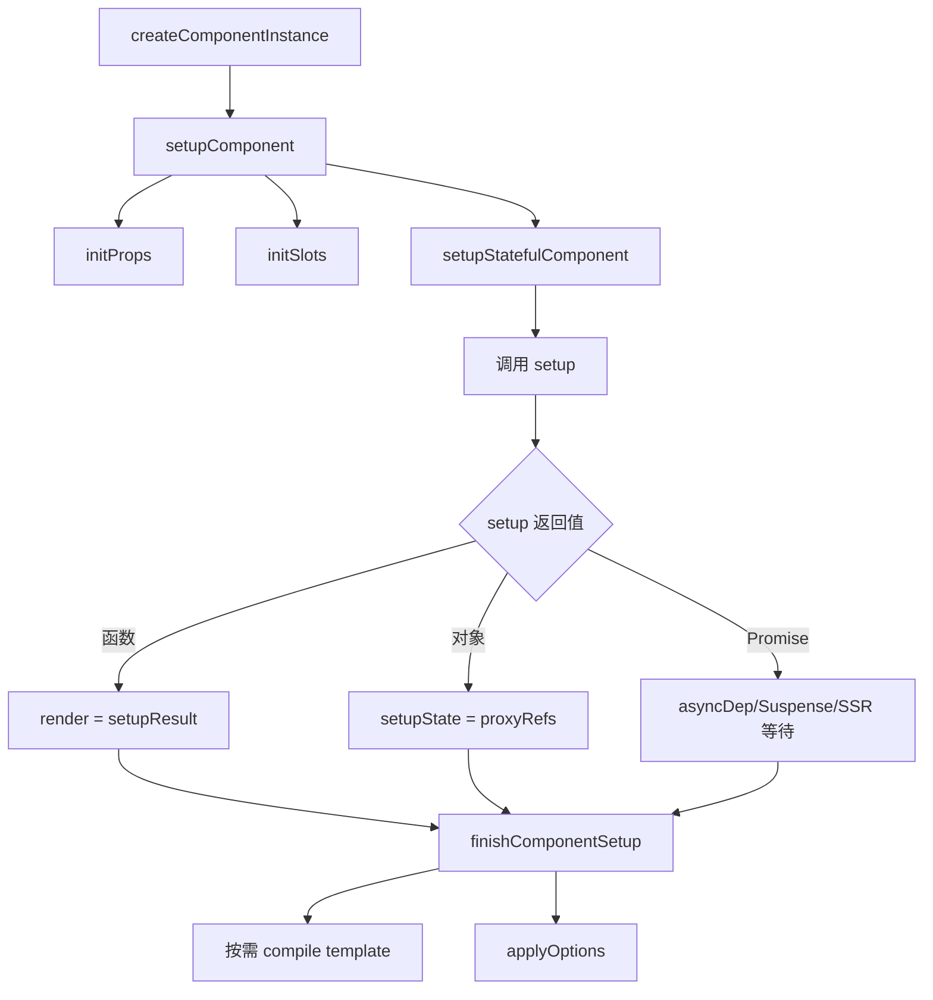

# Vue3 组件机制解析报告（runtime-core）

## 1. 分析范围
1. 主线文件：`component.ts`
2. 公开实例代理：`componentPublicInstance.ts`
3. Props 归一化与更新：`componentProps.ts`
4. Slots 归一化与优化：`componentSlots.ts`
5. Options API 兼容桥接：`componentOptions.ts`
6. 应用上下文与缓存：`apiCreateApp.ts`
7. 异步组件包装：`apiAsyncComponent.ts`

## 2. 组件初始化流程（从 VNode 到可渲染组件）

### 流程解读（对应源码）
| 阶段 | 核心函数 | 作用 | 代码位置 |
|---|---|---|---|
| 实例创建 | `createComponentInstance` | 建立组件内部实例，挂载 `scope`、`propsOptions`、`emitsOptions`、`emit`、父子关系等 | `component.ts:608` |
| 进入 setup 总入口 | `setupComponent` | 先初始化 `props` 和 `slots`，再进入 stateful setup | `component.ts:803` |
| 有状态组件初始化 | `setupStatefulComponent` | 创建 `proxy`，执行用户 `setup`，处理 async setup 与 Suspense/SSR | `component.ts:823` |
| setup 返回值归一 | `handleSetupResult` | 函数 -> render；对象 -> `setupState`；其他值开发警告 | `component.ts:923` |
| 收尾阶段 | `finishComponentSetup` | render/template 收敛、按需编译、Options API 融合、缺省告警 | `component.ts:987` |

## 3. Vue3 在组件设计上的核心升级

### 3.1 统一组件类型系统（TypeScript 维度）
1. Vue3 把对象组件、函数组件、类组件、`defineComponent` 返回类型统一建模，减少类型割裂。
2. 核心类型入口：`Component`、`FunctionalComponent`、`SetupContext`、`ComponentInternalInstance`。
3. 代码位置：`component.ts:218`、`component.ts:265`、`component.ts:282`、`component.ts:320`。

### 3.2 组件实例模型中心化
1. `ComponentInternalInstance` 汇总渲染、状态、生命周期、suspense、effect scope 等运行时状态。
2. 渲染器、响应式系统、调度器通过统一对象协作，降低系统耦合。
3. 代码位置：`component.ts:320`。

### 3.3 Proxy 公共实例与访问缓存（性能补强）
1. `PublicInstanceProxyHandlers` 代理 `this`，并以 `accessCache` 缓存 key 归属（setup/data/props/context）。
2. 这部分是渲染热路径优化点，减少频繁 `hasOwn` 判断成本。
3. 代码位置：`componentPublicInstance.ts:413`、`componentPublicInstance.ts:431`、`componentPublicInstance.ts:435`。

### 3.4 Composition API 优先，Options API 兼容桥
1. 主流程先跑 `setup`，再在 `finishComponentSetup` 中调用 `applyOptions`。
2. `applyOptions` 明确保留 Vue2 初始化顺序，迁移成本更低。
3. 代码位置：`component.ts:1061`、`componentOptions.ts:518`、`componentOptions.ts:577`。

### 3.5 Props / Attrs 分离与规范化
1. `initProps` + `setFullProps` 将声明 prop 与未声明 attrs 分离，未声明属性进入 `attrs` 透传。
2. 包含 Boolean cast、default 工厂缓存等细节。
3. 代码位置：`componentProps.ts:193`、`componentProps.ts:374`、`componentProps.ts:414`、`componentProps.ts:509`。

### 3.6 Slots 统一函数化与稳定性优化
1. Vue3 强调函数插槽，非函数值会在开发态提示，保障性能。
2. `SlotFlags.STABLE` 可跳过稳定插槽的不必要更新。
3. 代码位置：`componentSlots.ts:142`、`componentSlots.ts:185`、`componentSlots.ts:207`、`componentSlots.ts:224`。

### 3.7 异步组件与 Suspense 协同
1. `setup` 返回 Promise 时可挂 `asyncDep`，由 Suspense 管理异步边界。
2. 异步组件包装器通过 `__asyncLoader` 标记并接入 Suspense/SSR。
3. 代码位置：`component.ts:899`、`apiAsyncComponent.ts:43`、`apiAsyncComponent.ts:122`、`apiAsyncComponent.ts:182`。

### 3.8 编译器解耦（runtime-only 与 runtime-compiler）
1. 编译器通过 `registerRuntimeCompiler` 注入，runtime-only 构建更轻。
2. 有编译器才运行时 compile template，否则提示预编译方案。
3. 代码位置：`component.ts:975`、`component.ts:985`、`component.ts:1039`、`component.ts:1075`。

### 3.9 多 App 隔离与缓存
1. `createAppContext` 提供 app 级隔离配置与缓存（`optionsCache`、`propsCache`、`emitsCache`）。
2. 解决 Vue2 全局 API 容易互相污染的问题。
3. 代码位置：`apiCreateApp.ts:224`、`apiCreateApp.ts:240`、`apiCreateApp.ts:241`、`apiCreateApp.ts:242`。

## 4. 细节弥补与工程化增强
1. SSR 多份 Vue 副本兼容：通过全局 setter 同步 `currentInstance` 与 SSR setup 状态，缓解复杂 SSR 场景多副本问题。
   代码位置：`component.ts:725`、`component.ts:746`、`component.ts:755`。
2. `setupContext` 安全边界：`attrs` 只读，`expose()` 只允许一次，减少误用。
   代码位置：`component.ts:1099`、`component.ts:1132`、`component.ts:1159`。
3. 公开实例收敛：`getComponentPublicInstance` 优先暴露 `expose`，并通过 `publicPropertiesMap` 补齐 `$el/$props` 等能力。
   代码位置：`component.ts:1183`、`component.ts:1189`、`componentPublicInstance.ts:365`。
4. 开发态诊断增强：组件命名校验、缺 render/template、prop 只读告警，提升排障效率。
   代码位置：`component.ts:784`、`component.ts:1086`、`componentPublicInstance.ts:552`。
5. 运行时编译 `with` 模式专用代理：`RuntimeCompiledPublicInstanceProxyHandlers` 处理 `with` 作用域与全局白名单。
   代码位置：`componentPublicInstance.ts:620`、`componentPublicInstance.ts:624`。

## 5. 总结
1. `component.ts` 的核心价值是把“组件定义”转换为“可调度、可响应、可诊断”的实例。
2. Vue3 组件设计关键在于：类型统一、实例中心化、Proxy 热路径优化、setup 优先、异步边界标准化、编译器解耦、应用上下文隔离。
3. 这些设计在保持兼容迁移能力的同时，显著提升了性能、可维护性与工程扩展性。

